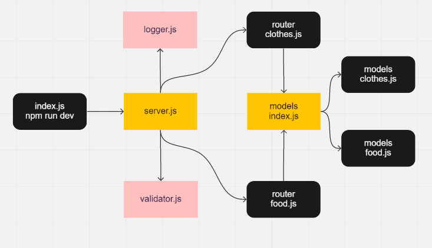

# basic-api-server

## Setup :
- .env /PORT=3000

## Test :
- npm run test

## Running the app:
- npm run dev

## Deployment Test :
- Heroku :https://essam-basic-express-server.herokuapp.com/
- Backend: https://github.com/essamomar93/basic-api-server
- Pull request : https://github.com/essamomar93/basic-api-server/pull/1

## Languages :
- javascript

## UML:

